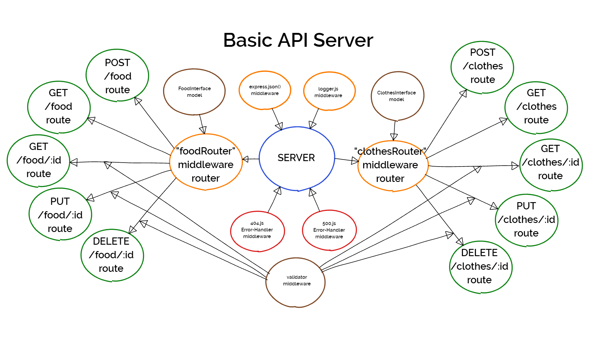

# Lab - 03: Basic API Server

## Overview

I build a REST API using Express, by creating a proper series of endpoints that perform CRUD operations on a database, using the REST standard

## Author: William Moreno

## Deployment

The app is deployed on Heroku at the following link:

- [basic-api-server](https://williammoreno-basic-api-server.herokuapp.com/)

## Daily Pull Request

Work was accomplished on the `dev` branch. The pull request to merge the code into the `main` branch is here:

- [Pull Request](https://github.com/William-Moreno/basic-api-server/pull/1)

Working features implemented:
- Express server properly structured
- 2 in-memory data models created using ES6 Classes and exported as Node Modules
- Classes designed with methods to perform `create()`, `read()`, `update()` and `delete()`
- middleware including `logger.js` and `validator.js`
- error-handlers including `404.js` and `500.js`
- router modules created for both models
- `server.js` that utilizes router modules and `use()` them

## Tests

Test suite created that tests for:
  - 404 on bad route
  - 404 on bad method
  - Correct status codes and returned data for the following:
    - Create a record using POST
    - Read a list of records using GET
    - Read a desired record using GET
    - Update a record using PUT
    - Destroy a record using DELETE

All tests successfully passed.

## UML

UML drawing created with [limnu](https://limnu.com/)

